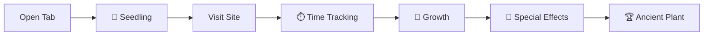

# 🌱 Tab Garden - Chrome Extension

<div align="center">

**Transform your browsing habits into a beautiful digital garden**


[](https://github.com/rishu685/plant_extension)
[](https://developer.chrome.com/docs/extensions/mv3/)
[](https://opensource.org/licenses/MIT)

[Features](#-features) •
[Installation](#-installation) •
[How It Works](#-how-it-works) •
[Plant Types](#-plant-types) •
[Growth System](#-growth-system) •
[Screenshots](#-screenshots)

</div>

---

## 🌟 Overview

Tab Garden is a Chrome extension that gamifies your browsing experience by transforming each open tab into a virtual plant in your personal digital garden. The more time you spend on a website, the more your plant grows - encouraging mindful browsing and helping you visualize your online habits.

### 🎬 Live Demo Preview
```
🕒 Browsing Session Timeline:
┌─ 0:00 ─────── 5:00 ─────── 10:00 ────── 15:00 ─────── 20:00 ─┐
│       Open     Plant       Young       Mature      Ancient    │
│   YouTube.com  grows!      plant       golden      sparkles   │
│      🌱    →    🌿    →     🌳    →     🌺    →      ⭐       │
│                                       ✨ Aura    ✨ Effects   │
└───────────────────────────────────────────────────────────────┘
     Your tabs evolve as you browse - encouraging mindful usage!
```

### ✨ Key Highlights
- 🎮 **Gamified Browsing**: Turn tab management into an engaging garden simulation
- 📈 **Growth Tracking**: Plants grow based on actual time spent on websites
- 🌈 **Visual Feedback**: Beautiful animations and effects for plant growth
- 📱 **Tiny Overlays**: See your plant progress directly on web pages
- 📊 **Smart Analytics**: Track your browsing patterns and time spent
- 🎨 **Responsive Design**: Works perfectly on all screen sizes

---

## 🚀 Features

### 🌱 **Digital Garden Experience**
- Replace boring new tab page with a vibrant garden visualization
- Each open browser tab becomes a unique plant in your garden
- Real-time updates as you browse and interact with websites

### 📊 **Intelligent Growth System**
- **5 Growth Levels**: Seedling → Sprout → Young → Mature → Ancient
- **Time-Based Evolution**: Plants grow every 5 minutes of active use
- **Visual Progression**: Size, brightness, and effects increase with growth
- **Golden Aura**: Special effects for mature plants (Level 4-5)

### 🎭 **Dynamic Plant Types**
Different websites spawn different plant types based on their domain:

| Plant | Websites | Appearance |
|-------|----------|------------|
| 🌿 Fern | YouTube, Video sites | Lush green fronds |
| 🌳 Bonsai | GitHub, Development | Elegant tree structure |
| 🌸 Flower | Twitter, Social media | Colorful blossoms |
| 🌵 Cactus | News, Information | Hardy desert plant |
| 🌻 Sunflower | Google, Search engines | Bright yellow petals |
| 🌲 Tree | Stack Overflow, Q&A | Tall evergreen |
| 🎋 Bamboo | Reddit, Forums | Flexible green stalks |
| 🌱 Sapling | All other sites | Generic young plant |

### 💫 **Advanced Features**
- **Health System**: Plants wilt after 24 hours of inactivity
- **Tab Overlay**: Tiny plant indicator on each webpage
- **Growth Animations**: Smooth transitions when plants level up
- **Sparkle Effects**: Special animations for ancient plants
- **Context Menu**: Right-click plants to close tabs
- **Keyboard Shortcuts**: Quick garden refresh and navigation
- **Statistics Dashboard**: Track total time and average growth levels

---

## 🛠 Installation

### Method 1: Load Unpacked Extension (Recommended)

1. **Download the Extension**
   ```bash
   git clone https://github.com/rishu685/plant_extension.git
   cd plant_extension
   ```

2. **Open Chrome Extensions Page**
   - Navigate to `chrome://extensions/` in your Chrome browser
   - Or click the puzzle piece icon → "Manage Extensions"

3. **Enable Developer Mode**
   - Toggle the "Developer mode" switch in the top right corner

4. **Load the Extension**
   - Click "Load unpacked" button
   - Select the `plant_extension` folder you downloaded
   - The extension will be installed immediately

5. **Verify Installation**
   - Open a new tab to see your garden
   - Visit any website to start growing plants!

### Method 2: Download ZIP

1. Click the green "Code" button → "Download ZIP"
2. Extract the ZIP file to your desired location
3. Follow steps 2-5 from Method 1

---

## 🌿 How It Works

### 🔄 **Plant Lifecycle**



### 📈 **Growth Progression**

| Level | Name | Time Required | Visual Changes | Special Effects |
|-------|------|---------------|----------------|-----------------|
| 1 | 🌱 Seedling | 0-5 minutes | Small, basic appearance | Gentle sway animation |
| 2 | 🌿 Sprout | 5-10 minutes | Slightly larger, brighter | Enhanced colors |
| 3 | 🌳 Young | 10-15 minutes | Medium size, saturated | Improved brightness |
| 4 | 🌺 Mature | 15-20 minutes | Large, golden border | Golden aura effect |
| 5 | ⭐ Ancient | 20+ minutes | Largest size, glowing | Sparkle animations |

### 🎯 **Interaction System**

- **Click Plants**: Switch to the corresponding browser tab
- **Right-Click**: Context menu to close tabs
- **Hover Effects**: Plants react with scaling and glow
- **Wilting**: Unused tabs become grayscale after 24 hours
- **Overlay Indicator**: Small plant icon on each webpage shows growth

---

## 📱 Screenshots

### 🏡 Main Garden View
```
🌱 Tab Garden - Your Digital Oasis
┌─────────────────────────────────────────────────────────────┐
│  🌱 Your Tab Garden 🌱                                      │
│  Transform your tabs into a beautiful digital garden        │
│                                                             │
│  🌿    🌳    🌸    🌵    🌻    🌲    🎋    ⭐              │
│ Fern  Bonsai Flower Cactus Sun   Tree  Bamboo Ancient      │
│ (L2)  (L3)  (L4)  (L1)  (L5)  (L2)  (L3)   (L5)         │
│                                                             │
│ 🌱 8 plants growing • 6 healthy • 0 wilting               │
└─────────────────────────────────────────────────────────────┘
```
*Beautiful garden layout with plants representing your open tabs*

### 🌱 Plant Growth Demonstration
```
Growth Progression System:
🌱 Level 1 (Seedling)  →  🌿 Level 2 (Sprout)   →  🌳 Level 3 (Young)
   0-5 minutes            5-10 minutes             10-15 minutes
   
🌺 Level 4 (Mature)    →  ⭐ Level 5 (Ancient)
   15-20 minutes          20+ minutes
   Golden aura ✨         Sparkle effects ✨
```
*Visual progression showing how plants evolve with time*

### 💫 Special Features Preview
```
Tab Overlays:          Growth Animations:       Statistics:
┌─────────────┐       🌱 → 🌿 → 🌳 → 🌺 → ⭐   📊 Garden Stats
│ YouTube  🌿2│       ✨ Smooth transitions    │ 8 plants total
│ GitHub   🌳3│       💫 Golden aura effects   │ 45 min avg time
│ Google   🌻5│       🎭 Sparkle animations    │ 3.2 avg level
└─────────────┘       � Real-time updates     └─────────────────
```
*Interactive overlays, smooth animations, and detailed analytics*

---

## ⚡ Technical Details

### 🏗 **Architecture**
- **Manifest Version**: V3 (Latest Chrome Extension Standard)
- **Background Script**: Service Worker for tab monitoring
- **Content Script**: Injected overlay for all web pages
- **Storage**: Local Chrome storage for plant data persistence
- **Permissions**: Minimal required permissions for functionality

### 📦 **File Structure**
```
plant_extension/
├── 📄 manifest.json          # Extension configuration
├── 🔧 background.js          # Service worker logic
├── 🎨 newTab.html            # Garden page structure
├── 💅 newTab.css             # Styling and animations
├── ⚡ newTab.js              # Garden interaction logic
├── 🖼️ content.js             # Tab overlay functionality
├── 📚 README.md              # Documentation
└── 📁 assets/                # Icons and images
    ├── icon16.png
    ├── icon48.png
    └── icon128.png
```

### 🔒 **Privacy & Security**
- **Local Storage Only**: All data stays on your device
- **No External Servers**: No data transmitted to third parties
- **Minimal Permissions**: Only requests necessary browser access
- **Open Source**: Complete transparency with public code

---

## 🎮 Usage Tips

### 🏆 **Maximize Your Garden**
1. **Visit Sites Regularly**: Keep plants healthy by returning to tabs
2. **Focus Time**: Spend meaningful time on sites to grow plants
3. **Close Unused Tabs**: Remove wilted plants to keep garden clean
4. **Explore Different Sites**: Collect all 8 plant types
5. **Watch Growth**: Enjoy the satisfying progression animations

### ⌨️ **Keyboard Shortcuts**
- `R` - Refresh garden display
- `Esc` - Close new tab
- `Right-click` - Access plant context menu

### 📈 **Growth Strategy**
- **Level 1-2**: Quick progression for new sites
- **Level 3-4**: Requires sustained engagement
- **Level 5**: Achievement for your most-used sites

---

## 🤝 Contributing

We welcome contributions to make Tab Garden even better! Here's how you can help:

### 🐛 **Bug Reports**
- Use GitHub Issues to report bugs
- Include browser version and steps to reproduce
- Screenshots are always helpful

### 💡 **Feature Requests**
- Suggest new plant types or growth mechanics
- Propose UI/UX improvements
- Share ideas for gamification features

### 🔧 **Development**
1. Fork the repository
2. Create a feature branch
3. Make your changes
4. Test thoroughly
5. Submit a pull request

### 📝 **Development Setup**
```bash
# Clone your fork
git clone https://github.com/YOUR_USERNAME/plant_extension.git
cd plant_extension

# Make changes and test in Chrome
# Load unpacked extension for testing

# Commit and push
git add .
git commit -m "Your feature description"
git push origin feature-branch
```

---

## 📄 License

This project is licensed under the MIT License - see the [LICENSE](LICENSE) file for details.

```
MIT License

Copyright (c) 2025 Tab Garden

Permission is hereby granted, free of charge, to any person obtaining a copy
of this software and associated documentation files (the "Software"), to deal
in the Software without restriction, including without limitation the rights
to use, copy, modify, merge, publish, distribute, sublicense, and/or sell
copies of the Software...
```

---

## 🙏 Acknowledgments

- **Chrome Extension APIs**: For providing the platform
- **Web Animations API**: For smooth plant growth animations
- **CSS Grid & Flexbox**: For responsive garden layout
- **Unicode Emoji**: For beautiful plant representations
- **Open Source Community**: For inspiration and feedback

---

## 📞 Support

### 🔗 **Quick Links**
- 🐛 [Report Bug](https://github.com/rishu685/plant_extension/issues)
- 💡 [Request Feature](https://github.com/rishu685/plant_extension/issues)
- 📖 [Documentation](https://github.com/rishu685/plant_extension/wiki)
- 💬 [Discussions](https://github.com/rishu685/plant_extension/discussions)

### ❓ **FAQ**

<details>
<summary><strong>Why aren't my plants growing?</strong></summary>
<br>
Plants grow based on active time spent on tabs. Make sure you're actively using the tab and wait for the growth intervals (every 5 minutes).
</details>

<details>
<summary><strong>Can I backup my garden data?</strong></summary>
<br>
Currently, all data is stored locally in Chrome. We're working on export/import functionality for future versions.
</details>

<details>
<summary><strong>Does this extension slow down my browser?</strong></summary>
<br>
No! Tab Garden uses efficient background processing and minimal resources. The extension is optimized for performance.
</details>

<details>
<summary><strong>Can I customize plant types?</strong></summary>
<br>
Currently, plant types are automatically assigned based on domains. Custom plant selection is planned for future updates.
</details>

---

<div align="center">

### 🌟 **Star this repository if Tab Garden helped you cultivate better browsing habits!** 🌟

**Made with 💚 for mindful browsing**

[⬆ Back to Top](#-tab-garden---chrome-extension)

</div>
